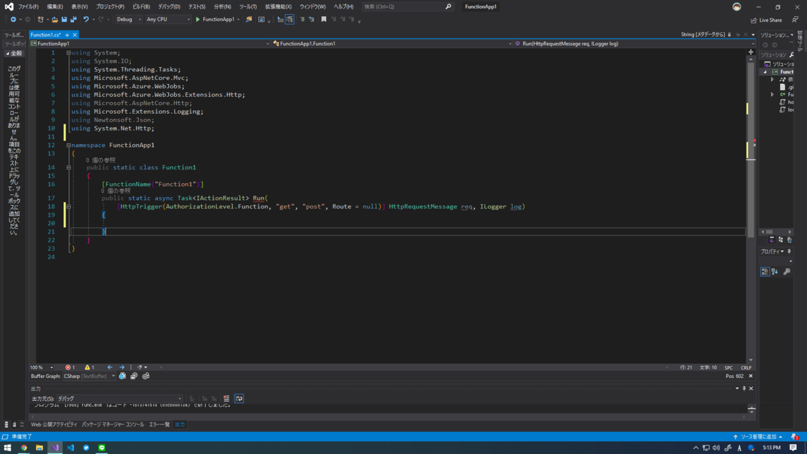
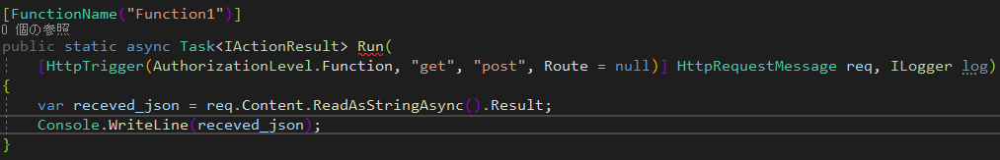

- AzureFunctions のプロジェクトを作る。

- VisualStudio から AzureFunctions の HttpTriger テンプレートを作成する。

作成すると

このようなテンプレートができます。

必要のない部分を削りました。

追加、編集したのは

HttpRequestをHttpRequestMessage に、 Using.Net.Http を追加しました。

このように書くと受け取った JSON を文字列の形式として見ることができます。

 

次は受け取った JSON をパース（扱いやすく）します。