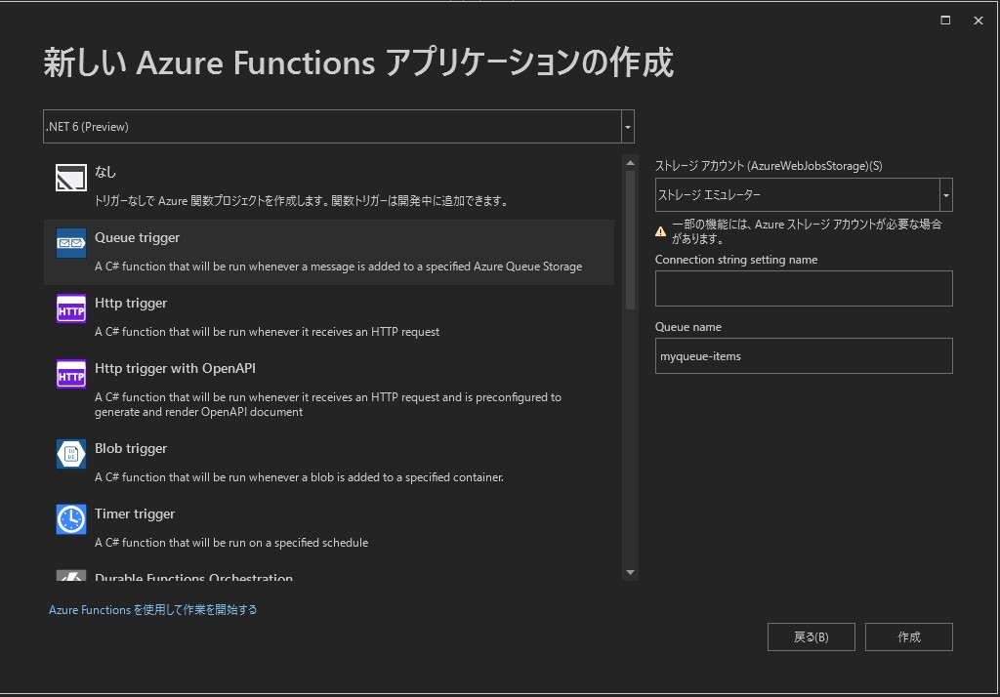
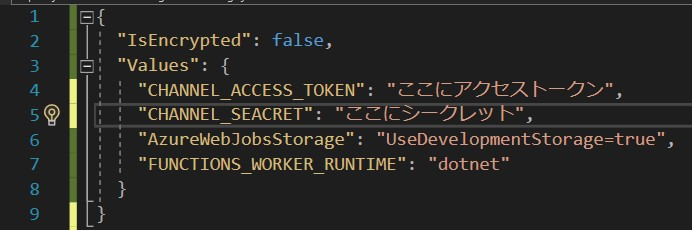

## プロジェクトを作成する。

Visual Studio を起動し、新しいプロジェクトから Azure Functions のテンプレートを選択します。  
プロジェクト名、場所、ソリューション名を決め、作成します。  
以下な表示が出るので Http Trigger を選択し、作成します。  


## ライブラリのインストール
Visual Studio 画面上部にある プロジェクト から Nugetパッケージの管理を開きます。  
参照から [line-bot-sdk-csharp](https://github.com/rikupin1105/line-bot-sdk-csharp) と検索し最新版をインストールします。
~~私が勝手に引き継いで機能を追加しているライブラリです。Issue PR大歓迎です。~~

## コードを書くよ
Function1.cs に Webhook を受け取る下記のコードと using を追加します。
[GitHub](https://github.com/rikupin1105/line-bot-sdk-csharp/blob/main/sample/FunctionAppSample/Function.cs) にサンプルコードを上げています。  
初めからあった [Function1] に関しては消していただいて結構です。
```cs
using LineMessagingAPI;
using LineMessagingAPI.Webhooks;
using System.Net;
```
``` cs
[FunctionName("Function")]
public static async Task<HttpResponseMessage> Run([HttpTrigger(AuthorizationLevel.Anonymous, "post", Route = null)] HttpRequestMessage req, ILogger log)
{
    {
        try
        {
            log.LogInformation(req.Content.ReadAsStringAsync().Result);
            var channelSecret = Environment.GetEnvironmentVariable("CHANNEL_SEACRET");
            var events = await req.GetWebhookEventsAsync(channelSecret);

            var app = new LineBotApp();

            await app.RunAsync(events);

            
            catch (InvalidSignatureException e)
            {
                return req.CreateResponse(HttpStatusCode.Forbidden, new { e.Message });
            }

            return req.CreateResponse(HttpStatusCode.OK);
        }
    }
}
```

LineBotApp(); の部分が赤線になると思いますが、気にせず次に進んでください。

ソリューションエクスプローラーの FunctionApp1(名前が違う可能性もあります) を右クリックして >追加 >クラス を選択します。  
名前を LineBotApp にし、追加します。

LineBotApp.cs 内に以下の Using を追加します。
```cs
using LineMessagingAPI;
using LineMessagingAPI.Webhooks;
```

そして以下のコードも追加します。
こちらも[GitHub](https://github.com/rikupin1105/line-bot-sdk-csharp/blob/main/sample/FunctionAppSample/LineBotApp.cs)にサンプルコードを上げています。

```cs
class LineBotApp : WebhookApplication
{
    private LineMessagingClient lineMessagingClient { get; set; }
    public LineBotApp()
    {
        lineMessagingClient = new LineMessagingClient(Environment.GetEnvironmentVariable("CHANNEL_ACCESS_TOKEN")); ;
    }
    protected override async Task OnMessageAsync(MessageEvent ev)
    {
        switch (ev.Message.Type)
        {
            case EventMessageType.Text:
                await Messaging(ev);
                break;

            case EventMessageType.Image:
            case EventMessageType.Audio:
            case EventMessageType.Video:
            case EventMessageType.File:
            case EventMessageType.Location:
            case EventMessageType.Sticker:
                break;
        }
    }

    private async Task Messaging(MessageEvent ev)
    {
        if (!(ev.Message is TextEventMessage msg)) { return; }
        await lineMessagingClient.ReplyTextAsync(ev.ReplyToken, msg.Text);
    }
}
```

これだけでオウム返しをするコードを作成することができました。

## LINE側の設定
[Line Developers](https://developers.line.biz/ja/) にアクセスしコンソールに移動します。  
ログインを求められるので LINEアカウント または ビジネスアカウントでログインしてください。  

はじめの画面ではプロパイダーを作成します。名前は何でもOKです。  
すでに作成済みのかたはそちらを使用していただいて構いません。

チャネル設定で Messaging API を選択します。
すでに使ったことのあるからは新規チャネル作成を選択し Messaging API を選択します。

チャネル名や業種を入力する欄があるので、当てはまるものを選択して、作成します。

## シークレットの設定

Visual Studio のソリューションエクスプローラーにある local.setting.json を開き Values 内に以下のコードを追加します。

```
"CHANNEL_ACCESS_TOKEN": "",
"CHANNEL_SEACRET": "",
```
CHANNEL_ACCESS_TOKEN の 右側の "" の中に、チャネルアクセストークンを入力します。("" は消さないこと)  
チャネルアクセストークンは Line Developers の Messaging API設定の一番下にチャネルアクセストークンの欄があるので発行をし、コピペします。  
CHANNEL_SEACRET も同じように入力します。
Line Developrs のチャネル基本設定の下の方にあります。  

下記のような感じになるはずです。  



## 友だち追加
Line Developrs の Messaging API設定 を開き、表示されているQRコードを読み取り、友達に追加します。  
せっかくなのでなにかメッセージを送ってみましょう。  
...  
当然オウム返しはしてくれません。
サーバーの設定などが必要になってくるためです。  
Azure にデプロイしても良いのですが、今回は開発時に便利な ngrok を使ってみましょう。

## ngrokの設定
[ngrok](https://ngrok.com/download) のサイトから ngrok をダウンロードします。  
同じページに導入方法が書かれているため、指示に従います。  
Pathを通しておくのも便利でいいですね。

## ついに
Visual Studioでプログラムを実行します。
プログラムを実行すると中に
```
Function: [POST] http://localhost:7071/api/Function
```
このような表記ができていると思います。  


ターミナルもしくはCMDやパワーシェルを開き、以下のコマンドを実行します。  
うまく行かない場合は、ngrokのディレクトリに居ないか、パスが通ってない、などが考えられます。  
パスを確認するか、ngrok.exe がある場所まで移動しコマンドを実行してください。
```
ngrok http 7071
```

ちなみにこのコマンドの 7071 はポート番号を示しており、プログラムを実行したときに localhost:〇〇〇〇 の部分と同じです。   
環境によっては違う番号が表示される場合があるのでそちらに合わせてください。

うまく実行できると、ターミナル内のどこかに、下記のような表示がでてくるので下の https の方の URL をコピーします。
```
Forwarding  http://*************.ngrok.io -> http://localhost:7071
Forwarding  https://://*************..ngrok.io -> http://localhost:7071    
```


Line Developers の Messaging API設定で WebhookURL に先程のURLを貼り付けます。  
URLの後ろに /api/Function を追加します。（VisualStudioのコンソール画面のポート番号の後ろに書かれているもの）

WebHookの利用をオンにして検証をしてみましょう。

成功となれば成功です。

LINEを開いてなにかメッセージを送ってみましょう。  
送ったことを同じ文章が返ってくれば成功です。

### おわりに
最後まで読んでいただきありがとうございました。  
次回は せっかくだからAzureにデプロイしよう を予定しています。