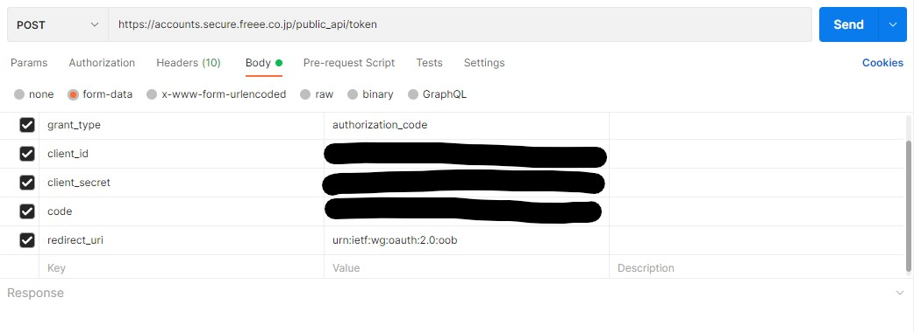

Freee の認証は Oauth2.0 を使用していて、アクセストークンの有効期限は 24 時間です。  
AzureFunctions でログイン画面を用いた認証はできないので（できるなら教えてほしい）アクセストークンとリフレッシュトークンを保存し、有効期限内に更新、保存しておく必要があります。  
今回は Azure Functions を使用して、 Azure Key Vault に保存をしてみます。

# はじめに

- 今回使用する Azure Key Vault ですが、初めて使用したため、もっと良い使い方があるかもしれません。
- 自分が実際に行ったことを思い出して書いたため、ところどころ抜けている可能性があります。
- 自分用のメモ的な感じで書いているので、内容の正確性は保証しません。参考程度にどうぞ

## 前提

- Microsoft Azure が使用できる
- Visual Studio 2022(その他バージョンでも動くはず)が使用できる
- [Freee アプリストア](https://app.secure.freee.co.jp/)より、アプリを作成済みである。
- Freee アカウントを所持しており、事業所アカウントがある（アプリストアより開発用事業所を作成可能です)

## 参考にしたもの

- [freee API ドキュメント](https://developer.freee.co.jp/docs)
- [Microsoft Docs](https://docs.microsoft.com/ja-jp/azure/key-vault/secrets/quick-create-net)

## 手順

[Azure Portal](https://portal.azure.com/) にアクセスし、Azure Key Vault のリソースの作成します。

サブスクリプションやリソースグループ、 KeyVault 名は任意で設定してください。
地域は、西日本と東日本のどちらかで良いでしょう。価格レベルも標準のままで良いでしょう。  
KeyVault の料金体系は[こちら](https://azure.microsoft.com/ja-jp/pricing/details/key-vault/)を参考にしてください。

Freee のアプリ管理に、Web アプリ認証用 URL があるので、ブラウザからアクセスをします。

Freee アカウントでログイン後認可コードが表示されるので、認可コードを使用して、アクセストークンとリフレッシュトークンを取得します。  
下記の画像は Postman を使用して、取得したときの例です。



これでアクセストークンとリフレッシュトークンが取得できました。

KeyVault のリソースにアクセスし、設定欄のシークレットから 生成/インポート をクリックします。

名前は任意で設定可能です。(FreeeAccessToken)などが良いでしょうか。
値には先程取得したアクセストークンを入力します。

同じ手順で、リフレッシュトークンも設定しておきましょう。

VisualStudio から新しいプロジェクト、Azure Functions、Timer trigger のプロジェクトを作成し、下記のコードのようにします。

```cs
private static string _keyVaultUrl = "KEY_VAULT_URL";
private static string _secretName = "FreeeAccessToken";
private static string _refreshToken = "FreeeRefreshToken";

[FunctionName("RefreshToken")]
public static async Task RefreshToken([TimerTrigger("0 0 */12 * * *")] TimerInfo myTimer, ILogger log)
{
    var httpclient = new HttpClient();
    var client = new SecretClient(new Uri(_keyVaultUrl), new DefaultAzureCredential());

    KeyVaultSecret refreshToken = client.GetSecretAsync(_refreshToken).Result;
    KeyVaultSecret accessToken = client.GetSecretAsync(_secretName).Result;

    var parameters = new Dictionary<string, string>()
    {
        { "grant_type", "refresh_token" },
        { "client_id", Environment.GetEnvironmentVariable("freee_client_id") },
        { "client_secret", Environment.GetEnvironmentVariable("freee_client_secret") },
        { "refresh_token", refreshToken.Value },
    };
    var content = new FormUrlEncodedContent(parameters);
    httpclient.DefaultRequestHeaders.Add("Authorization", "Bearer " + accessToken.Value);
    var res = await httpclient.PostAsync("https://accounts.secure.freee.co.jp/public_api/token", content).Result.Content.ReadAsStringAsync();

    var o = JsonConvert.DeserializeObject<ResponseObject>(res);

    await client.SetSecretAsync(_secretName, o.access_token);
    await client.SetSecretAsync(_refreshToken, o.refresh_token);
}

public class ResponseObject
{
    public string access_token { get; set; }
    public string token_type { get; set; }
    public int expires_in { get; set; }
    public string refresh_token { get; set; }
    public string scope { get; set; }
    public int created_at { get; set; }
}
```

1 行目は Azure Key Vault の URL を指定します。  
2,3 行目は、Key Vault で設定した、名前を指定します。

6 行目の("0 0 \*/12 \* \*")この部分ですが、Timertrigger が実行される時間を表していて、今回の場合は 0 時と 12 時（UTC）に実行されます。 日本時間であれば 9 時と 21 時ですね。

### 発行

ソリューションエクスプローラーからプロジェクトを右クリックして、発行します。

ターゲットは Azure、特定のターゲットには Azure Function App(Windows)を選択します。  
サブスクリプションを選択肢、関数アプリを選択します、関数アプリを新規追加することも可能です。その場合はプランの消費は課金を抑えるために消費にすることをおすすめします。  
なお Functions 自体は無料範囲内ですが、AzureStorage の課金が発生します。（毎月数円程度）

デプロイは完了しましたが、実はこのままでは Functions が Key vault のシークレットにアクセスができません。

### プリンシパルの設定

Azure Portal で先程作成した関数アプリのリソースに移動します。  
設定欄の ID に移動し、システム割り当て済みの状態をオンにし、保存をします。  
オブジェクト(プリンシパル)ID が表示されたら OK です。

Key Vault のリソースに移動して、設定欄のアクセスポリシーに移動します。  
アクセスポリシーの追加をクリックし、シークレットのアクセス許可を設定します。今回の場合は、取得と、セットがあれば OK です。  
プリンシパルの選択で先程オンにしたプリンシパル ID を選択します。リソース名で検索すればでてくるはずです。

追加をし、保存をします。

これでアクセストークンが 12 時間おきに更新されるようになりました。

# 終わりに

redirectURL を設定して、AzureFunctions にも手を加えれば、認可コードの取得後、手動でアクセストークンを取る必要がない気がします。  
今回タイマートリガーは 12 時間おきに設定しましたが、1 日 1 回(24 時間おき)でも問題ないと思われます。
