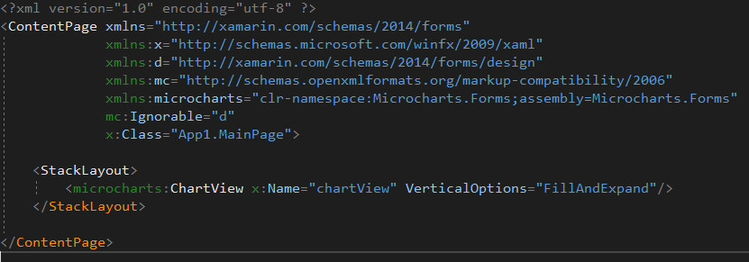
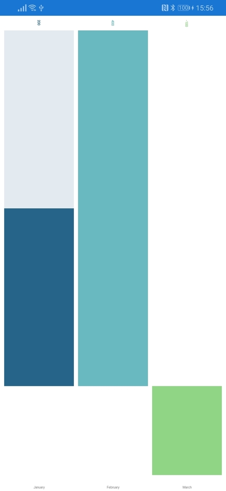

Xamarinでグラフを描くライブラリの一つ Microcharts を使ってみました。

https://github.com/dotnet-ad/Microcharts


Xamarin forms の プロジェクトを作成したら Nugetから Microcharts とMictocharts.Forms をインストールします。


インストールが完了したら MainPage.Xaml に

```
xmlns:microcharts="clr-namespace:Microcharts.Forms;assembly=Microcharts.Forms"
```

を追加します。


そしてその下にある <StackLayout> の中に

```
<microcharts:ChartView x:Name="chartView" VerticalOptions="FillAndExpand"/>
```

を追加します。


次にMainPage.xaml.csにコードを書いていきます。
```csp
public MainPage()
        {
            InitializeComponent();

            var entries = new[]
            {
                new Microcharts.Entry(200)
                {
                    Label = "January",
                    ValueLabel = "200",
                    Color = SKColor.Parse("#266489")
                },
                new Microcharts.Entry(400)
                {
                    Label = "February",
                    ValueLabel = "400",
                    Color = SKColor.Parse("#68B9C0")
                },
                new Microcharts.Entry(-100)
                {
                    Label = "March",
                    ValueLabel = "-100",
                    Color = SKColor.Parse("#90D585")
                }
            };
            
            var chart = new BarChart() { Entries = entries };
            this.chartView.Chart = chart;
        }
```
このように記述し、実行してみます。  


棒グラフが完成しました。

ソースコードの BarChart の部分を変更することで

* PointChart  (ポイントチャート)
* LineChart (線グラフ)
* DonutChart (ドーナツグラフ)
* RadialGaugeChart (円グラフ)
* RadarChart (レーダーチャート)
になります。

まだ書きたいこともありますが一旦公開します。